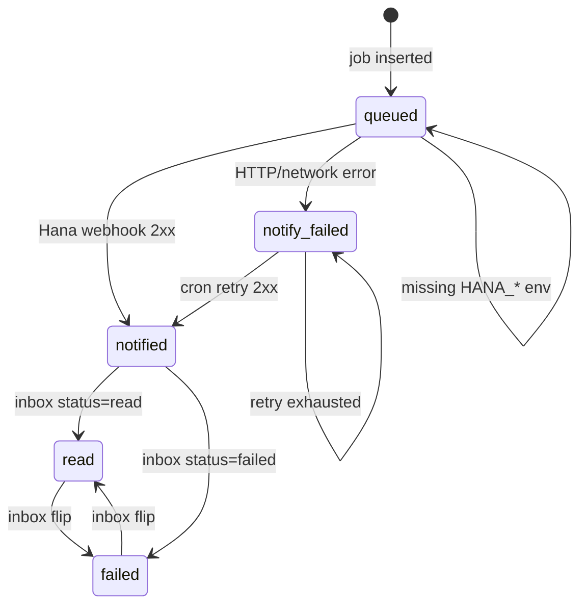
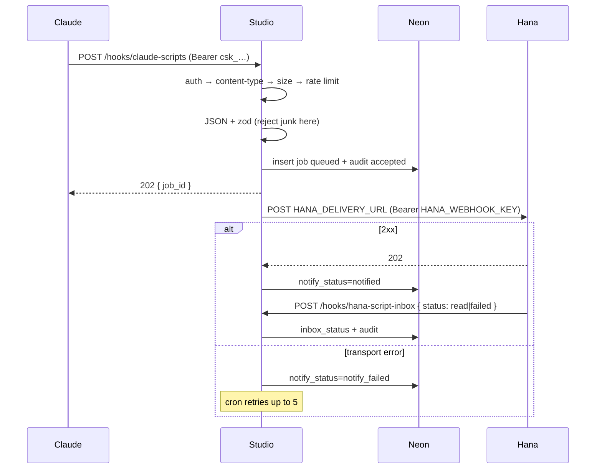

# Claude → Hana script upload (design sketch)

> **Status:** Design only. No implementation in this PR.  
> **Audience:** Colton (review of contract + tables before code).  
> **Scope:** a keyed JSON endpoint so Claude can POST a lesson/dialogue **script** into Studio, which then pings **Hana** the same way Studio already pings **Shohei** for QA notes.  
> **Non-goals:** writing `dialogue_scenario` / `source_script` (Hana still authors Studio via MCP), Studio UI for the inbox, MCP `upload_script` tool, accepting raw `.md` files or collection JSON dumps.

Today: Claude writes a script → Colton pastes it into a Hana chat → Hana fills Studio (`patch_scenario`, optional `sourceScript`). This endpoint deletes the paste step.

Reuse, don't parallel: `/hooks/shizen-note` + `shizen_note_job` + `after(() => deliverToShohei)` + `SHOHEI_DELIVERY_URL` / `SHOHEI_WEBHOOK_KEY`. Same skip-proxy `/hooks/` prefix (`webapp/proxy.ts` already treats `/hooks/` as public so the route's own bearer check applies).

---

## 0. Decisions (one line each)

| # | Topic | Decision |
|---|---|---|
| 1 | Claude API key | **Hashed rows in `claude_script_api_key`**, not an env var. Independent issue / rotate / revoke. Logs use public `key_id` only. |
| 2 | Content-Type | Only `application/json` (optional `charset=utf-8`). Mismatch → **415**. |
| 3 | Max body | **64 KiB**. Enforced on `Content-Length` before read, then again on bytes. |
| 4 | Rate limit | Postgres sliding window **per `key_id`**: 10 / 60s and 40 / 1h. **429** + `Retry-After`. Dedupe identical retries by content hash + optional `Idempotency-Key`. |
| 5 | Audit | Append-only `claude_script_audit` (time, `key_id`, script name, outcome). Never stores the script body. |
| 6 | Validate | Zod **before any job insert**. Junk never lands in `claude_script_job.payload`. |
| 7 | Notify Hana | After accept: insert job `queued`, `after(() => deliverToHana)`, POST `HANA_DELIVERY_URL` with `Bearer $HANA_WEBHOOK_KEY`. Cron retries transport failures. |
| 8 | Hana inbox | `POST /hooks/hana-script-inbox` with `Bearer $HANA_INBOX_TOKEN` marks the ping **read** or **failed**. |

This is a **relay + inbox**, not an import. Accepted scripts do **not** PATCH `dialogue_scenario.source_script`. That field stays Studio-only for the markdown brief Hana (or a human) pastes after she authors the scene (`webapp/lib/db/schema.ts`, MCP `patch_scenario`).

---

## 1. What already exists (grounding)

| Piece | Where | Takeaway |
|---|---|---|
| Claude brief | `dialogue_scenario.source_script` (`text`, migration `0012`). Freeform markdown. Panel placeholder: “Paste the Claude `.md` Hana used…”. Preview expects GFM tables `Speaker / Japanese / English / Delivery`. **No parser.** | Optional `source_script` string on the upload; not the thing we schema-check. |
| Line shape | `spokenLineSchema` / `stageLineSchema` / `inlineQuestionLineSchema` in `webapp/lib/dialogue/types.ts` | Upload lines reuse that union, then tighten (required Japanese, length caps). |
| Generate-lines | `lineCount` 2–24; default prompt “6–10 lines”; Gemini wants speaker + japanese + romaji + english | Spoken-line count cap **2–24**. Romaji/english optional here — Hana often fills them. |
| MCP | `get_scenario` / `patch_scenario` can set `sourceScript`. No upload tool. | Hana keeps writing Studio through MCP after she receives the ping. |
| Collection import | `POST /api/content/dialogues/import` + `collectionFileSchema` | Full published lesson JSON (quiz, highlights, tokenSync). **Wrong grain** for a Claude script. |
| TTS script import | `parseDialogueCollection` in `webapp/lib/tts/dialogue-import.ts` | Walks collection JSON into speaker1/2 tracks. Not this path. |
| Shohei notes | `POST /hooks/shizen-note` (`SHIZEN_NOTE_WEBHOOK_TOKEN`) and `POST /api/client/content-qa/notes` (`CONTENT_QA_CLIENT_TOKEN`). Auth **before** body. Zod, then `shizen_note_job`, then `after(deliverToShohei)`. Missing delivery env → stay `queued`, do not POST. Status `queued \| delivered \| failed`. **No retry, no content-type check, no size cap beyond screenshot chars, no rate limit, no inbox ACK.** | Copy the job + `after()` + env-target pattern; add the checks notes lack. |
| Tokens today | All bearers are **env vars** + `timingSafeEqual` (`webapp/lib/studio-auth.ts`) | Fine for one Shohei destination. Wrong for a revocable Claude key we want to name in logs. |
| Error style | Notes: plain text `401`/`400`. Content APIs: `{ error }` or Zod `.flatten()`. | This route is a machine client (Claude) → **JSON `{ error, code }`**. |
| Real sizes | `shizen/Resources/Dialogue/train-station.json` = **23 265 B**, 5 scenes. Largest scene JSON ≈ **4.7 KB**. Spoken lines 5–6 / scene, Japanese ≤ **21 chars**. | 64 KiB is ~3× a whole lesson file, ~14× a scene. |

---

## 2. Routes

| Method | Path | Caller | Auth |
|---|---|---|---|
| `POST` | `/hooks/claude-scripts` | Claude | Claude key (hashed table) |
| `POST` | `/hooks/hana-script-inbox` | Hana | `HANA_INBOX_TOKEN` (env, timing-safe) |
| `GET` | `/api/cron/claude-scripts` | Vercel Cron | `CRON_SECRET` / `STUDIO_AGENT_TOKEN` (same as `/api/cron/slides`) |

`/hooks/*` already bypasses the Studio proxy. Cron stays behind the existing proxy bearer. Neither Claude nor Hana tokens are accepted on other routes; `STUDIO_AGENT_TOKEN` / `CONTENT_QA_CLIENT_TOKEN` are **rejected** on the Claude upload.

Prod base: `https://shizen-studio.vercel.app`.

---

## 3. Request pipeline (upload)

Strict order. Fail closed. Stop at the first error.

```
auth → content-type → size → rate limit → JSON parse → validate → idempotency → persist job → audit accept → after(notify Hana)
```

| Step | Rule | Fail |
|---|---|---|
| 1 Auth | `Authorization: Bearer <token>`. Lookup `claude_script_api_key` by public id in the token, `timingSafeEqual` on SHA-256. Revoked / unknown / missing → 401. **Do not read the body yet** (same as notes). | `401 unauthorized` |
| 2 Content-Type | Header must start with `application/json` (allow `application/json; charset=utf-8`). | `415 unsupported_media_type` |
| 3 Size | If `Content-Length` present and `> 65536` → reject without reading. Then `request.arrayBuffer()`; if `byteLength > 65536` → reject. Missing `Content-Length` is OK if the body still fits. | `413 payload_too_large` |
| 4 Rate limit | Count **this key's** audit rows in the windows (includes 4xx after auth). In-memory maps are useless on Vercel. | `429 rate_limited` + `Retry-After` |
| 5 JSON | `JSON.parse` the buffered bytes (UTF-8). | `400 invalid_json` |
| 6 Validate | `claudeScriptUploadSchema.safeParse`. On failure, audit `rejected` with `name` if parseable, **do not insert a job**. | `400 invalid_script` |
| 7 Idempotency | If `Idempotency-Key` matches `(key_id, idempotency_key)` **or** `(key_id, content_hash)` exists in the last 24h → return the existing `job_id`, audit `duplicate`, **do not re-POST Hana**. | `202` (`idempotent: true`) |
| 8 Persist | Insert `claude_script_job` (`queued`) + audit `accepted`. `after(() => deliverToHana(jobId))`. | `202` |

Auth failures are **not** audited (no trusted `key_id`; avoid filling the table with probes).

---

## 4. Auth keys (Claude)

Existing Studio tokens are env vars (`STUDIO_AGENT_TOKEN`, `CONTENT_QA_CLIENT_TOKEN`, `SHIZEN_NOTE_WEBHOOK_TOKEN`). That cannot revoke Claude without a Vercel env change, and logs cannot say *which* key without storing an id.

**Store hashed keys in Postgres.** Hana's *destination* keys stay env vars, like Shohei.

### Token format

```
csk_<keyId>.<secret>
```

- `keyId` — public, 12-char base64url, **this is what logs and audit use**.
- `secret` — 32-char base64url, shown **once** at issue time.
- DB stores `secret_hash = sha256(utf8(full token))`, never the secret.

### Table

```ts
export const claudeScriptApiKey = pgTable("claude_script_api_key", {
  id: text("id").primaryKey(), // csk_<12>
  name: text("name").notNull(), // "claude-prod"
  secretHash: text("secret_hash").notNull(), // hex sha256
  createdAt: timestamp("created_at", { withTimezone: true }).notNull().defaultNow(),
  revokedAt: timestamp("revoked_at", { withTimezone: true }),
  lastUsedAt: timestamp("last_used_at", { withTimezone: true }),
});
```

### Issue / rotate / revoke

| Action | How |
|---|---|
| Issue | `pnpm tsx scripts/issue-claude-script-key.ts --name claude-prod` inserts a row and prints the bearer **once**. No Studio UI in v1. |
| Rotate | Issue a new row, give Claude the new bearer, revoke the old id. Overlap is OK. |
| Revoke | `UPDATE … SET revoked_at = now() WHERE id = 'csk_…'`. Next request is 401. |
| Identify | Logs: `claude-scripts key=csk_abc123 job=job_… name="Buying a ticket"`. Never log `Authorization` or `secret_hash`. |

Lookup: split on the first `.`; load row by `id`; if missing or `revoked_at` set → 401; `timingSafeEqual(sha256(token), secretHash)`.

---

## 5. Payload + validation

Not a collection file. Not opaque markdown. Claude POSTs **one scene script** as JSON. Structured `lines` are the contract; optional markdown is the brief Hana used to get via paste.

### Illustrative schema

```ts
const JP = /[\p{Script=Hiragana}\p{Script=Katakana}\p{Script=Han}]/u;

const spoken = z.object({
  type: z.literal("spoken").optional(),
  speaker: z.string().trim().min(1).max(40),
  japanese: z.string().trim().min(1).max(80).refine((s) => JP.test(s), "japanese must contain Japanese script"),
  romaji: z.string().trim().min(1).max(160).optional(),
  english: z.string().trim().min(1).max(240).optional(),
  delivery: z.string().trim().max(80).optional(), // Gemini tags, e.g. "[softly]"
  grammarPointIDs: z.array(z.string().min(1).max(64)).max(12).optional(),
});

export const claudeScriptUploadSchema = z.object({
  name: z.string().trim().min(1).max(120),
  collection_id: slugSchema.optional(),      // hint only, no FK
  slug: slugSchema.optional(),               // hint only
  setting: z.string().trim().min(1).max(400).optional(),
  source_script: z.string().trim().min(1).max(32_000).optional(), // Claude .md brief
  lines: z.array(dialogueLineSchema /* + spoken refine above */).min(2).max(40),
}).superRefine((body, ctx) => {
  const spokenCount = body.lines.filter(isSpokenLine).length;
  if (spokenCount < 2 || spokenCount > 24) {
    ctx.addIssue({ code: "custom", message: "spoken line count must be 2–24" });
  }
});
```

Stage / ト書き and inline-question rows are allowed (same union as Studio) but **do not** count toward the 2–24 spoken cap. `source_script` is optional; if present it is length-checked only (no markdown parse — the repo has none).

### Rules (reject = 400, no job row)

| Check | Limit | Why |
|---|---|---|
| `name` | required, 1–120 | Audit + Hana title |
| `lines` | 2–40 rows; **2–24 spoken** | `generateLinesRequestSchema.lineCount` max 24; live scenes are 5–6 spoken |
| Spoken `speaker` | required, 1–40 | `spokenLineSchema.speaker` |
| Spoken `japanese` | required, 1–80, must match Hiragana/Katakana/Han | Live max 21 chars; 80 leaves room for N4/N3. Rejects romaji-only / English junk. **Not** the MCP “B line > 24 chars” warning (that's a style flag, not a hard fail). |
| `romaji` / `english` | optional, length-capped | Generate-lines requires them; Hana often authors them. Don't block a script that's Japanese-first. |
| `delivery` | optional, ≤80, trimmed via `normalizeDelivery` | Open-ended Gemini tags; no enum |
| Stage row | `type: "stage"`, `text` 1–200, `visibility` `cold\|practice` | Existing `stageLineSchema` |
| Inline-question | existing quiz fields, `prompt` 1–200, ≤6 choices | Existing `inlineQuestionLineSchema` |
| `collection_id` / `slug` | optional `slugSchema` (`^[a-z0-9]+(?:-[a-z0-9]+)*$`) | Filename hints for Hana. **No** existence check — she may create the lesson. |
| Unknown keys | Zod `.strict()` on the root object | Drop accidental `quiz` / `tokenSync` / screenshot blobs |
| Japanese sanity | each spoken `japanese` has `\p{Script=Hiragana\|Katakana\|Han}`; reject if ≥30% of chars are ASCII letters (romaji pasted in `japanese`) | Catches `Toukyou ni ikitai` in the Japanese field |

`grammarPointIDs` are **not** checked against `teaching_pattern` in v1 (Hana maps grammar). Ids, if present, must be non-empty strings.

### 400 body

```json
{
  "error": "invalid_script",
  "code": "invalid_script",
  "issues": [
    { "path": "lines.0.japanese", "message": "japanese must contain Japanese script" }
  ]
}
```

Cap `issues` at 10. Do not echo the script.

---

## 6. Size (64 KiB)

| Evidence | Bytes |
|---|---|
| Whole `train-station.json` lesson | 23 265 |
| Largest scene in that file | ~4 700 |
| 24 spoken lines × ~200 B/line + 8 KB markdown brief | ~13 000 (headroom) |

**64 KiB (65 536 bytes)** ≈ 3× the only in-repo collection file, 14× a scene. Big enough for a dense N3 script + markdown table; small enough to refuse a dumped lesson, a screenshot, or a retry loop of concatenated scripts.

Enforced in the route handler (Vercel's ~4.5 MB function cap is far too high). Notes cap screenshots at 1.5M chars because they carry JPEGs; this endpoint does not.

---

## 7. Rate limit + idempotency

No Redis in the webapp. Notes already persist jobs in Neon. Count **audit rows** per `key_id`.

| Window | Limit |
|---|---|
| Rolling 60s | 10 requests |
| Rolling 1h | 40 requests |

Counted after auth, including 415/413/400. Identical retries that hit the idempotency short-circuit still write an audit `duplicate` and **count**.

**429:**

```json
{ "error": "rate_limited", "code": "rate_limited" }
```

Header `Retry-After: <seconds>` = time until the oldest row in the saturated window falls out (minimum 1, maximum 3600).

**Idempotency** (after validate, before insert):

1. Optional header `Idempotency-Key` (1–128 printable ASCII). Unique on `(key_id, idempotency_key)` where not null.
2. `content_hash = sha256(canonical JSON of the validated body)` (sorted keys). If the same `key_id` + hash was **accepted** in the last 24h, return that job.

Duplicate response:

```json
{ "job_id": "job_…", "idempotent": true, "notify_status": "notified" }
```

---

## 8. Tables / migration

Next SQL file: `webapp/drizzle/0019_claude_script_upload.sql` (journal is at `0018_shizen_note_screenshot_key`). Hand-written SQL + drizzle schema, same as notes. Do not auto-write `dialogue_scenario`.

```sql
CREATE TABLE "claude_script_api_key" (
  "id" text PRIMARY KEY NOT NULL,
  "name" text NOT NULL,
  "secret_hash" text NOT NULL,
  "created_at" timestamptz DEFAULT now() NOT NULL,
  "revoked_at" timestamptz,
  "last_used_at" timestamptz
);

CREATE TABLE "claude_script_job" (
  "id" text PRIMARY KEY NOT NULL,              -- job_<random> like notes
  "created_at" timestamptz DEFAULT now() NOT NULL,
  "updated_at" timestamptz DEFAULT now() NOT NULL,
  "key_id" text NOT NULL REFERENCES "claude_script_api_key"("id"),
  "name" text NOT NULL,
  "payload" jsonb NOT NULL,                    -- validated body only
  "content_hash" text NOT NULL,
  "idempotency_key" text,
  "notify_status" text DEFAULT 'queued' NOT NULL,  -- queued | notified | notify_failed
  "notify_attempts" integer DEFAULT 0 NOT NULL,
  "inbox_status" text,                         -- null | read | failed
  "error" text
);
CREATE UNIQUE INDEX "claude_script_job_idempotency_idx"
  ON "claude_script_job" ("key_id", "idempotency_key")
  WHERE "idempotency_key" IS NOT NULL;
CREATE INDEX "claude_script_job_hash_idx"
  ON "claude_script_job" ("key_id", "content_hash", "created_at");
CREATE INDEX "claude_script_job_retry_idx"
  ON "claude_script_job" ("notify_status", "notify_attempts");

CREATE TABLE "claude_script_audit" (
  "id" uuid PRIMARY KEY DEFAULT gen_random_uuid() NOT NULL,
  "created_at" timestamptz DEFAULT now() NOT NULL,
  "key_id" text NOT NULL REFERENCES "claude_script_api_key"("id"),
  "name" text,                                 -- script name if known
  "job_id" text,
  "outcome" text NOT NULL                      -- accepted | duplicate | rejected | rate_limited | payload_too_large | unsupported_media_type | notify_failed | read | failed
);
CREATE INDEX "claude_script_audit_rate_idx"
  ON "claude_script_audit" ("key_id", "created_at");
```

Audit is short on purpose: timestamp, key, name, outcome. The script body lives only on `claude_script_job.payload`, and only after validation.

---

## 9. Notify Hana (after accept)

Mirror `webapp/lib/shizen-notes/deliver.ts` + `delivery-target.ts`.

```
resolveHanaDeliveryTarget()
  HANA_DELIVERY_URL  +  HANA_WEBHOOK_KEY
  missing → mark notify_status=queued, error="HANA_DELIVERY_URL is not set", do not POST
```

POST JSON, 15s timeout (`DELIVERY_TIMEOUT_MS` today is 15s), `Content-Type: application/json`, `Authorization: Bearer $HANA_WEBHOOK_KEY`.

```json
{
  "job_id": "job_…",
  "name": "Buying a ticket",
  "collection_id": "train-station",
  "slug": "buying-a-ticket",
  "setting": "At the ticket counter — a tourist approaches the station attendant.",
  "source_script": "# Buying a ticket\n\n| Speaker | Japanese | English | Delivery |\n…",
  "lines": [
    { "speaker": "Tourist", "japanese": "東京に行きたいんですけど。。。", "english": "So, I'd like to go to Tokyo...", "delivery": "[hesitant]" }
  ],
  "created_at": "2026-10-08T19:00:00.000Z"
}
```

Hana's webhook should return **2xx quickly** (accept into her inbox). Studio then sets `notify_status=notified`. HTTP 4xx/5xx or network → `notify_failed` + truncated error (500 chars, same as notes).

**Retry (notes have none; this path needs it because Claude retry loops are the failure mode we just rate-limited on the inbound side):**

- First attempt: `after(() => deliverToHana(jobId))` (same as `acceptNote`).
- Sweep: `GET /api/cron/claude-scripts` every 5 minutes. Retries rows with `notify_status IN ('queued','notify_failed')` AND `notify_attempts < 5` AND `error` not “env not set”.
- Give up after 5 attempts; leave `notify_failed`. No automatic ping after Hana has already 2xx'd.

`notify_status` is **transport**. `inbox_status` is **Hana processed it**. Do not collapse them the way notes collapse to `delivered`.

---

## 10. Hana inbox

```
POST /hooks/hana-script-inbox
Authorization: Bearer $HANA_INBOX_TOKEN
Content-Type: application/json
```

Inbound token is **separate** from `HANA_WEBHOOK_KEY` (outbound), same split as `SHIZEN_NOTE_WEBHOOK_TOKEN` vs `SHOHEI_WEBHOOK_KEY`. Env var is enough: one Hana, revoke by rotating Vercel env.

```json
{ "job_id": "job_…", "status": "read" }
{ "job_id": "job_…", "status": "failed", "error": "could not match collection" }
```

| | |
|---|---|
| Auth | Bearer `HANA_INBOX_TOKEN`, before body. 401 on miss. |
| Job missing | `404 unknown_job` |
| `notify_status != notified` | `409 not_notified` — she cannot ACK a ping Studio never successfully sent |
| `read` | `inbox_status=read`, clear `error`, audit `read`. Idempotent if already `read`. |
| `failed` | `inbox_status=failed`, store `error` (required, ≤500). Audit `failed`. Does **not** re-POST the webhook. Hana already has the payload; she retries on her side. |
| `read` → `failed` | Allowed (she can flip after a later failure). |
| `failed` → `read` | Allowed (she recovered). |

### Status lifecycle



---

## 11. Examples

### Upload (Claude)

```bash
curl -sS -X POST https://shizen-studio.vercel.app/hooks/claude-scripts \
  -H "Authorization: Bearer $CLAUDE_SCRIPT_TOKEN" \
  -H "Content-Type: application/json" \
  -H "Idempotency-Key: buying-a-ticket-v3" \
  -d '{
    "name": "Buying a ticket",
    "collection_id": "train-station",
    "slug": "buying-a-ticket",
    "setting": "At the ticket counter — a tourist approaches the station attendant.",
    "source_script": "# Buying a ticket\n\n| Speaker | Japanese | English | Delivery |\n|---|---|---|---|\n| Tourist | 東京に行きたいんですけど。。。 | So, I'\''d like to go to Tokyo... | [hesitant] |",
    "lines": [
      {
        "speaker": "Tourist",
        "japanese": "東京に行きたいんですけど。。。",
        "english": "So, I'\''d like to go to Tokyo...",
        "delivery": "[hesitant]"
      },
      {
        "speaker": "Attendant",
        "japanese": "はい、わかりました。こちらへどうぞ。",
        "english": "Yes, of course. Please come this way."
      }
    ]
  }'
```

**202**

```json
{ "job_id": "job_xK4n2pQ8a", "idempotent": false, "notify_status": "queued" }
```

`notify_status` in the HTTP response is always `queued` on a fresh accept (delivery runs after the response). Polling is out of scope; Hana's inbox is the completion signal.

### Inbox (Hana)

```bash
curl -sS -X POST https://shizen-studio.vercel.app/hooks/hana-script-inbox \
  -H "Authorization: Bearer $HANA_INBOX_TOKEN" \
  -H "Content-Type: application/json" \
  -d '{"job_id":"job_xK4n2pQ8a","status":"read"}'
```

**200** `{ "ok": true, "job_id": "job_xK4n2pQ8a", "inbox_status": "read" }`

---

## 12. Sequence



---

## 13. Error codes

| Status | `code` | When |
|---|---|---|
| 401 | `unauthorized` | Missing/bad/revoked Claude or Hana bearer |
| 409 | `not_notified` | Inbox ACK on a job that never got a 2xx from Hana |
| 404 | `unknown_job` | Inbox `job_id` not found |
| 413 | `payload_too_large` | Body > 64 KiB |
| 415 | `unsupported_media_type` | Content-Type not `application/json` |
| 429 | `rate_limited` | Window exceeded; `Retry-After` set |
| 400 | `invalid_json` | Body is not JSON |
| 400 | `invalid_script` | Zod / Japanese / line-count failure (`issues[]`) |
| 400 | `invalid_inbox` | Inbox body not `{ job_id, status: read\|failed }` |
| 202 | — | Upload accepted (or idempotent replay) |
| 200 | — | Inbox updated |

Error JSON: `{ "error": "<code>", "code": "<code>", "issues"?: [...] }`. No stack traces, no script echo.

---

## 14. Env vars

| Var | Side | Role |
|---|---|---|
| *(none for Claude inbound)* | — | Keys live in `claude_script_api_key` |
| `HANA_DELIVERY_URL` | Studio → Hana | Webhook URL (same idea as `SHOHEI_DELIVERY_URL`) |
| `HANA_WEBHOOK_KEY` | Studio → Hana | Bearer Hana expects (same idea as `SHOHEI_WEBHOOK_KEY`) |
| `HANA_INBOX_TOKEN` | Hana → Studio | Bearer for `/hooks/hana-script-inbox` |
| `CRON_SECRET` | Vercel → Studio | Existing; reuse for retry cron |
| `DATABASE_URL` | — | Existing Neon |

Do not introduce `CLAUDE_SCRIPT_UPLOAD_TOKEN`. Do not accept `CONTENT_QA_CLIENT_TOKEN` on these hooks.

Cron entry (add to `webapp/vercel.json`): `{ "path": "/api/cron/claude-scripts", "schedule": "*/5 * * * *" }`.

---

## 15. Open questions

1. **Should a later Hana MCP `patch_scenario` copy `source_script` onto the scene automatically**, or does she still paste? This design never writes `dialogue_scenario`.
2. **Reject unknown `collection_id`?** v1 is a hint only, so Hana can create new lessons. FK would block greenfield scripts.
3. **Markdown-only uploads?** No parser exists; v1 requires structured `lines`. A GFM-table parser can wait.
4. **Studio UI** for jobs / failed inbox? Out of scope. `db:studio` + audit table is enough to start.
5. **Redeliver button** after 5 failed POSTs? v1 is cron-only. Add `POST /hooks/claude-scripts/:jobId/retry` later if needed.
6. **Hana webhook 2xx vs inbox `read`.** If her ingest is synchronous, inbox is extra. Kept separate so a 2xx “I queued it” is not “I authored the scene.”

---

## 16. Implementation checklist

1. Drizzle: `claude_script_api_key`, `claude_script_job`, `claude_script_audit` + `0019_claude_script_upload.sql` + journal entry.
2. `webapp/scripts/issue-claude-script-key.ts` (print bearer once, store hash).
3. `webapp/lib/claude-scripts/schema.ts` — Zod + Japanese refine + tests (mirror `shizen-notes/payload.test.ts`).
4. `webapp/lib/claude-scripts/auth.ts` — parse `csk_id.secret`, hashed compare, revoked check.
5. Size + content-type helpers; rate-limit query against audit.
6. `POST /hooks/claude-scripts` — pipeline order as in §3. Auth before body.
7. `accept.ts` + `deliver.ts` + `delivery-target.ts` (copy notes, swap Shohei → Hana env names).
8. `POST /hooks/hana-script-inbox` + inbox Zod.
9. `GET /api/cron/claude-scripts` + `vercel.json` cron.
10. Content-hash + idempotency unique index.
11. `webapp/AUTH.md` — document the two hooks and the three Hana/Claude env/table facts.
12. Tests: schema rejects, 415/413, duplicate hash, missing `HANA_DELIVERY_URL` does not fetch (copy `delivery-target.test.ts`).

**Done when:** Claude can 202 a valid two-line Japanese script with a hashed key; a second identical POST returns the same `job_id`; Hana's URL is POSTed; she can mark that `job_id` read; an English-only `japanese` field never inserts a job.
