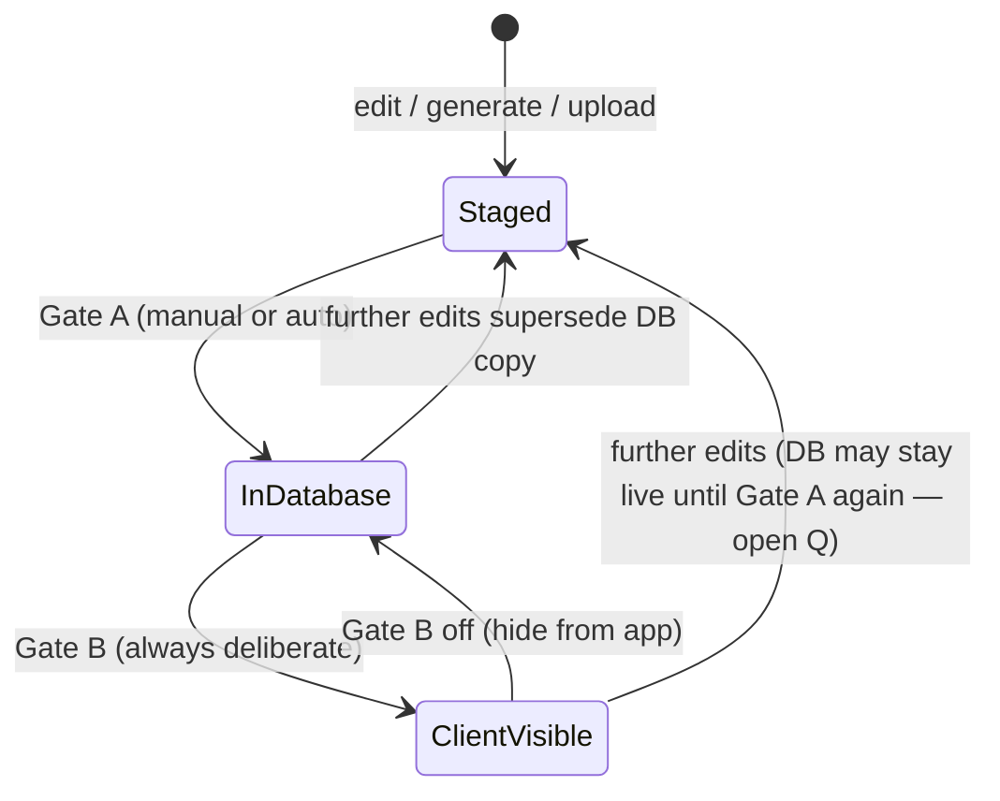

# Studio: two-gate curriculum publish (design sketch)

> **Status:** Phase 1 **shipped in Studio UI** (same PR as this doc). Follow-ups: Gate B emerald restyle + Curriculum N5/N4/N3 subtabs. Full Staging desk / auto-Gate-A remain Phase 2.  
> **Audience:** Colton (~15–20 min review of intent; UI is demoable).  
> **Scope:** product / UX architecture for Shizen Studio curriculum review → publish.  
> **Non-goals (still):** full Staging tab workbench, risk auto-Gate-A classifier, per-scene Gate B, CDN publish rewrite. Mobile Timing chrome from #36/#37 untouched.

### Phase 1 shipped vs Phase 2 still open

| Area | Phase 1 (this PR) | Phase 2 (deferred) |
|---|---|---|
| Thumbnail chip on Curriculum | Own / inherited / missing alongside audio·timing·sync·quiz | Thumb “stale” when a future staging model exists |
| Review queue pipeline | Staged → In database → Client-visible derived from flags / published take / `isActive` | Richer change-set staging |
| Publish & mark complete | Select → Gate A publish → mark reviewed; never flips `isActive` | Bulk Gate A from Staging desk |
| Collapsible lessons | Expand opened/first; collapse others with waiting count | Remember preference server-side |
| Gate B clarity | Curriculum + lesson editor: emerald “Visible to learners” (not white/inverted fill) | Confirm modal + change summary |
| Curriculum JLPT tracks | N5 / N4 / N3 subtabs (`?jlpt=`), filter by `curriculumUnit.jlptLevel` | — |
| Staging tab + dual badges | — | Full publish desk |
| Risk auto-Gate-A | — | Rules table in §5 |

---

## 1. Problem

Today Studio has **three loosely related axes**, not one pipeline:

| Axis | What it is today | Where |
|---|---|---|
| Take review | Auto-stamp flags cleared; `source: reviewed`; `reviewedAt` telemetry | Review queue / Token timing |
| Scenario “publish” | CDN clip + lockstep snapshot (`publishedAt`, audio/timing/sync/quiz chips go green) | Scenario Audio panel |
| Lesson live | `dialogueCollection.isActive` — public CMS only serves active lessons | Curriculum “Visible to learners” (Gate B) |
| Content QA (learner client) | Dialogue + quiz looked over from the app; freeform note | Readiness `qa` chip — see `docs/studio-content-qa-review.md` |

Operators experience “publish” as one word, but **shipping audio to CDN** and **making a lesson consumable in the learner app** are different stakes. Staging (draft work waiting) is also invisible as a first-class queue — Review queue is flag-driven, Curriculum chips are readiness, and `isActive` is a quiet toggle. **Learner-client content QA** is a fourth axis (scene looked-over in the app); it does not flip Gate A or Gate B.

**Goal:** one explicit **two-gate** pipeline:

1. **Gate A — Staging → database** — move content into the DB / CDN publish surface. Low-friction.
2. **Gate B — Database → client-visible** — flip the switch that makes content consumable in the learner app. Deliberate, high-stakes. **Not the same action as Gate A.**

---

## 2. Pipeline states (canonical)

Every curriculum unit of work (scene / lesson-scoped change set) sits in exactly one pipeline stage for publish purposes:



| State | Meaning | Operator feeling |
|---|---|---|
| **Staged** | Changed in Studio, not yet committed through Gate A | “Waiting to land” |
| **In database** | Landed via Gate A; exists for Studio / CDN / internal preview; **not** client-visible (or not yet for *this* change) | “Safe in the vault” |
| **Client-visible** | Gate B on for the lesson (or scoped unit — see open Q); learners can consume | “Live in the app” |

**Important mapping (proposal, not shipped):**

- Gate A ≈ today’s scenario publish + any future “write staged fields into DB” for non-audio assets (thumbnails, quiz copy, etc.), plus risk-based auto for low-risk deltas.
- Gate B ≈ today’s `isActive` (or a successor that can be more granular — open Q). Gate B does **not** run when Gate A succeeds.

---

## 3. Proposed Studio chrome

### 3.1 Top-level: Staging as a tab (with badge)

Add a **Staging** entry in Studio nav (near Review queue / Curriculum), with a **badge count** of items staged and waiting for Gate A.

```
┌──────────────────────────────────────────────────────────────────────────┐
│  Dialogues  Curriculum  Grammar  …  Review  Staging(12)  Ambience  …     │
│                                          ▲                               │
│                                          └── count of staged units       │
└──────────────────────────────────────────────────────────────────────────┘
```

Staging tab is the **workbench for Gate A** (and shows Gate B status for context). It is not a separate product area from Curriculum — it is the publish desk.

### 3.2 Second indicator: in DB but not client-visible

Alongside Staging’s badge, surface a **second count** for items that have passed Gate A but are **not yet client-visible**.

Two placement options (prefer A for scanability):

| Option | Placement | Rationale |
|---|---|---|
| **A (preferred)** | Staging tab header: two chips — `Staged 12` · `In DB · not live 4` | Same desk; both gates in one UI |
| B | Second nav badge on Curriculum or a “Live” pill | Splits attention |

```
┌─ Staging ───────────────────────────────────────────────────────────────┐
│                                                                          │
│   ○ Staged waiting          ● In DB · not live         ● Live            │
│     [ 12 ]                    [ 4 ]                      (filter)        │
│                                                                          │
│   Gate A is the default action on this page.                             │
│   Gate B is the deliberate “ship to learners” control below.             │
└──────────────────────────────────────────────────────────────────────────┘
```

### 3.3 Both gates in the same UI — Gate B heavier

**Same page, different weight.**

```
┌─ Staging / Publish desk ────────────────────────────────────────────────┐
│                                                                          │
│  FILTER: [ All ] [ Staged ] [ In DB ] [ Live ]     Search…               │
│                                                                          │
│  ┌─ Lesson: Train station ──────────────────────── pipeline: In DB ────┐ │
│  │  Scenes: 3 staged · 1 in DB · 0 live-affecting                       │ │
│  │                                                                      │ │
│  │  ┌ Gate A ─────────────────────────────────────────────────────────┐ │ │
│  │  │  Publish 3 staged scenes to database              [ Publish → ] │ │ │
│  │  │  Low-friction. Preview / Studio only until Gate B.              │ │ │
│  │  └─────────────────────────────────────────────────────────────────┘ │ │
│  │                                                                      │ │
│  │  ╔ Gate B — Make visible in the learner app ══════════════════════╗ │ │
│  │  ║  This lesson is IN THE DATABASE but NOT shown to learners.     ║ │ │
│  │  ║                                                                ║ │ │
│  │  ║  [ ] I understand learners will see this content               ║ │ │
│  │  ║                                                                ║ │ │
│  │  ║           ┌──────────────────────────────┐                     ║ │ │
│  │  ║           │  SHIP TO LEARNERS            │  ← primary, loud    ║ │ │
│  │  ║           └──────────────────────────────┘                     ║ │ │
│  │  ║  or  [ Keep hidden ]                                           ║ │ │
│  │  ╚════════════════════════════════════════════════════════════════╝ │ │
│  └──────────────────────────────────────────────────────────────────────┘ │
└──────────────────────────────────────────────────────────────────────────┘
```

**Gate B affordances (intentional):**

- Stronger border / contrast / copy (“learners will see…”)
- Explicit confirmation (checkbox + confirm, or modal with change summary)
- Placement **below** Gate A so the low-friction path is first, but Gate B reads as the ceremony
- Never auto-toggle from Gate A (including auto-Gate-A)

---

## 4. Curriculum page — thumbnail badge (no new tab)

Thumbnails stay on the **existing Curriculum** (and scenario editor) surfaces. **Do not** add a Thumbnails tab.

Today readiness chips: **audio · timing · sync · quiz · thumb · qa**  
(`scenario-readiness-chips.tsx` / `scenario-readiness.ts`).

**Thumbnail chip** (Phase 1): own-vs-inherited semantics (already partially in scenario editor: “own thumbnail” / “inherits lesson”).

**Content QA chip** (learner-client review): `qa —` / `qa dial` / `qa quiz` / `qa ✓` (+ `·` when a note exists). Not take review. Contract: `docs/studio-content-qa-review.md`.

| Scene thumbnail state | Chip label (sketch) | Tone | Meaning |
|---|---|---|---|
| Unset → inherits lesson thumb | `thumb ↓` or `thumb inherit` | muted / draft | Optional; OK if lesson has a thumb |
| Unset + lesson also unset | `thumb —` | muted | Nothing to show in app |
| Own override set | `thumb ✓` or `thumb own` | ok (emerald) | Scene-specific CDN thumb |
| Own set but stale vs staged | `thumb stale` | warn | Edited / replaced; needs Gate A |
| Inherited, lesson thumb changed | `thumb ↓ stale` | warn | Inheritance target moved |

```
Curriculum row chips (existing + new):

  [audio ✓] [timing ✓] [sync ✓] [quiz 3] [thumb ↓]
                                      ▲
                                      └── inherit (no scene override)
  [audio ✓] [timing ✓] [sync ✓] [quiz 3] [thumb own]
                                      ▲
                                      └── custom scene thumbnail
```

**Inheritance rule (product):** scenes may omit a thumbnail; the app uses the **lesson** thumbnail. Badge must make **own vs inherited** obvious so operators don’t think “missing thumb” = broken.

---

## 5. Risk-based Gate A threshold (idea)

**Gate B is always deliberate.** Gate A can be **manual or auto** based on change risk.

| Change type | Risk | Gate A | Gate B |
|---|---|---|---|
| Scene inherits lesson thumbnail (null override; lesson thumb already in DB) | Low | **Auto** to DB | Still deliberate |
| Lesson thumbnail upload / replace | Medium–high | **Manual** | Deliberate |
| Scene custom thumbnail upload / replace | High (visible art) | **Manual** | Deliberate |
| Quiz add / edit / reorder | High | **Manual** | Deliberate |
| Audio republish (lines / bed / timing / token sync lockstep) | High | **Manual** (today’s Publish) | Deliberate |
| Copy / title / menuTitle typo-only (if detectable) | Low–medium | Auto or Manual — **open Q** | Deliberate |
| Unpublishing / removing CDN clip | High | Manual + confirm | Deliberate (may need Gate B off first — open Q) |

```
                    ┌──────────────┐
   edit ──────────► │   Staged     │
                    └──────┬───────┘
           low-risk │      │ high-risk
                    ▼      ▼
              auto Gate A   wait for operator Gate A
                    │      │
                    └──────┤
                           ▼
                    ┌──────────────┐
                    │ In database  │
                    └──────┬───────┘
                           │ always human
                           ▼
                    ┌──────────────┐
                    │ Client-visible│  ← Gate B
                    └──────────────┘
```

**Callout for reviewers:** auto-Gate-A never implies auto-Gate-B. Low-risk auto only shortens the Staging queue; learners still need an intentional Ship.

---

## 6. Review queue — keep it meaningful

Review queue today (`review-queue.tsx`) is **flag-centric**: auto-stamped takes with non-empty `tokenSync.flags`. Approve clears flags + sets `reviewedAt`. Timing telemetry also tracks `openedAt` / `publishedAt`. Cards do not yet show a full **publish pipeline** position.

### 6.1 Show where each item is in the pipeline

Fold publish position into each take / lesson group:

| Pipeline column / badge | Maps to |
|---|---|
| **Staged** | Reviewed (or ready) but not Gate-A’d |
| **In database** | Gate A done for this take/scene (`publishedAt` / scenario published) |
| **Client-visible** | Parent lesson `isActive` (or successor) |

```
┌─ Review queue ──────────────────────────────────────────────────────────┐
│  Timing summary … (keep)                                                 │
│                                                                          │
│  ▼ Lesson: Train station                    pipeline: Staged → In DB     │
│    ┌ Take card ───────────────────────────────────────────────────────┐ │
│    │  Platform 1 · 4 flagged · selected                                │ │
│    │  Pipeline:  ● Staged  ○ In DB  ○ Client-visible                   │ │
│    │  [ Play ] [ Approve take ] [ Publish & mark complete ] [ Open ]   │ │
│    └───────────────────────────────────────────────────────────────────┘ │
│                                                                          │
│  ▷ Lesson: Grocery (collapsed — not reviewing yet)           2 waiting  │
└──────────────────────────────────────────────────────────────────────────┘
```

### 6.2 Prior feedback to fold in

1. **Publish-and-mark-complete from Review queue context** — one control that: Approves (clears flags / `reviewedAt`) **and** runs Gate A for that take/scene when appropriate, then marks the review item complete. Does **not** flip Gate B.
2. **Collapsible lessons** the operator is not ready to review yet — default expand “in progress / has flags”; collapse others with a waiting count so the queue stays scannable.

### 6.3 What Review queue is *not*

- Not Gate B. Shipping to learners stays on Staging / Curriculum live controls.
- Not a replacement for Curriculum readiness chips; queue is take-review + pipeline awareness.

---

## 7. ASCII wireframes (full surfaces)

### 7.1 Curriculum list (thumbnail chip)

```
Curriculum
════════════════════════════════════════════════════════════════
Unit 1 — Getting around
  ▾ Train station                          [In the app ○]   ← Gate B today
      Scene          audio  timing  sync  quiz   thumb
      Platform 1      ✓      ✓      ✓    3     ↓ inherit
      Ticket booth    ✓      ready  ✓    —     own
      Exit            draft  —      —    —     —
```

### 7.2 Staging desk (both gates)

```
Staging                                          Staged 12 │ In DB·not live 4
────────────────────────────────────────────────────────────────────────────
[ Staged ] [ In DB ] [ Live ] [ All ]

Lesson · Train station
  Status: 2 scenes staged · lesson currently HIDDEN from learners

  Gate A — Publish to database
  ┌────────────────────────────────────────────────────────────┐
  │ Platform 1 · audio+timing ready · thumb inherit (auto OK)  │
  │ Ticket booth · custom thumb · quiz changed → needs manual  │
  │                                                            │
  │ [ Publish eligible (1 auto + select) ]  [ Publish selected ]│
  └────────────────────────────────────────────────────────────┘

  Gate B — Ship to learners                         ★ high stakes
  ╔════════════════════════════════════════════════════════════╗
  ║ Learners cannot see this lesson yet.                       ║
  ║ Diff since last live: 2 scenes, 1 quiz, lesson thumb.      ║
  ║                                                            ║
  ║ ☐ Confirm ship to production learner app                   ║
  ║                                                            ║
  ║        [  SHIP TO LEARNERS  ]      [ Keep hidden ]         ║
  ╚════════════════════════════════════════════════════════════╝
```

### 7.3 Review queue pipeline

```
Review queue
────────────────────────────────────────────────────────────────
Summary card (unchanged metrics)

▾ Train station — reviewing
  Take · Platform 1
    flags: stamp-in-silence ×2
    pipeline: [Staged●] [In DB○] [Client-visible○]
    actions: Play | Approve | Publish & mark complete | Open

▷ Grocery — 2 waiting (collapsed)
▷ Cafe — 0 waiting (collapsed)
```

---

## 8. Interaction notes (Gate A vs Gate B)

| | Gate A | Gate B |
|---|---|---|
| Verb | Publish to database / Land staged | Ship to learners / Make visible |
| Friction | Low; bulk OK; some autos | High; confirm; summary of what goes live |
| Undo | Republish / unpublish scene assets | Toggle off → hide from public CMS |
| Success toast | “In database — not yet visible to learners” | “Live in the app” (keep today’s copy spirit) |
| Failure | Stay staged; show reason | Stay in DB; never half-flip without clear state |
| Coupling | May auto on low-risk | **Never** auto from Gate A |

---

## 9. Data / API sketch (non-binding)

Illustrative only — implementation PR would design migrations.

| Concept | Possible backing | Notes |
|---|---|---|
| Staged | Diff vs last Gate-A snapshot; or explicit `stagedAt` / content hash | Curriculum chips already encode “studio ready vs published” amber |
| In database | Scenario `published*` fields + collection fields after Gate A | Align with lockstep publish |
| Client-visible | `isActive` today; maybe per-scene later | Open Q on granularity |
| Auto Gate A eligibility | Risk classifier on change set | Table in §5 |
| Pipeline in Review | Derive from flags + publishedVariantId + isActive | Avoid new mandatory columns for v1 if derivable |

---

## 10. Open questions

1. **Granularity of Gate B** — lesson-only (`isActive`) forever, or eventual per-scene / per-change-set visibility?
2. **After live edits** — if a live lesson gets new staged work, does Gate A update the live CDN immediately (learners see new audio after A) while Gate B stays on? Or freeze live until Gate B “promote”?
3. **Auto Gate A audit** — toast-only, or Staging activity log?
4. **Copy / title changes** — auto or manual Gate A?
5. **Unpublish while live** — require Gate B off first?
6. **Staging badge count unit** — scenes, lessons, or change-sets?
7. **Review “Publish & mark complete”** — always Gate A only; confirm never Gate B in that control.
8. **Grammar Staging** — keep separate from dialogue Staging tab naming to avoid collision with grammar import docs.
9. **`reviewedAt` vs pipeline** — first-class curriculum state, or remain telemetry while pipeline badges use publish + isActive?
10. **Preview for In DB · not live** — Studio-only preview URL / “staff preview” in iOS before Gate B?

---

## 11. Success criteria for *this* sketch PR

- [x] Pipeline states named and diagrammed
- [x] Staging tab + badge + second “in DB not live” indicator *(Phase 2 — doc only)*
- [x] Both gates same UI; Gate B heavier *(Phase 1: Gate B copy/weight on existing live toggle; full desk Phase 2)*
- [x] Thumbnail chip on Curriculum (own vs inherit); no new tab **(Phase 1 shipped)**
- [x] Risk auto-Gate-A table; Gate B always deliberate *(table in doc; auto Phase 2)*
- [x] Review queue pipeline + publish-and-mark-complete + collapsible lessons **(Phase 1 shipped)**
- [x] Open questions listed
- [x] Phase 1 Studio UI implementation (same PR)

---

## 12. Repo anchors (verified)

| Area | Path |
|---|---|
| Review queue UI | `webapp/components/tts/review-queue.tsx` |
| Review timing | `webapp/lib/dialogue/review-timing-core.ts` |
| Readiness chips | `webapp/components/dialogue/scenario-readiness-chips.tsx` |
| Readiness logic | `webapp/lib/dialogue/scenario-readiness.ts` |
| Publish / unpublish | `webapp/lib/dialogue/publish.ts` |
| Lesson live toggle | `dialogueCollection.isActive` — Curriculum + collection editor |
| Scene thumb inherit | `dialogueScenario.thumbnailUrl` null → collection thumb; editor badge already “own / inherits” |
| Public CMS gate | `webapp/lib/dialogue/public-api.ts` filters `isActive` |

Recent related shipping (context only): PR #36 (mobile Timing + Approve take), #37 (Timing chrome density). This sketch is architecture, not a polish pass.
